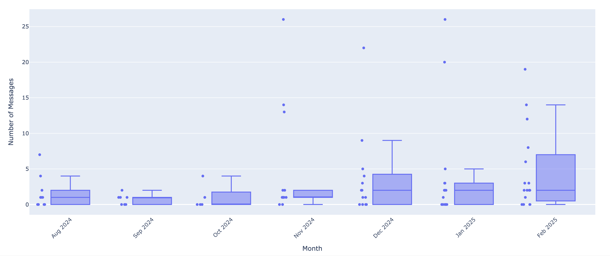

# Hinge Data Analysis
## Purpose
This project analyzes personal data exported from Hinge to provide valuable insights into the user's experiences on the platform. By examining the user's profile, dating preferences, and interactions with other users, the project aims to reveal patterns, trends, and meaningful statistics that enhance the understanding of how users engage with Hinge and make decisions based on their preferences.

### Getting Your Personal Data
Hinge allows active users to request an export of their personal data that were collected while they have had an account. If you have a Hinge account, you can request your data by going to Settings -> Download My Data. It typically takes between 24 and 48 hours to fulfill this request, and once the data are ready, Hinge provides a `.zip` file with your personal data.

## Project Structure
This is the structure of the project and what each section does at a high level.
```bash
app/
├── analytics/           # Core application logic and data analysis for users and matches
│   ├── __init__.py
│   └── MatchAnalytics.py
│   └── UserAnalytics.py

├── assets/              # Contains image files copied from the media folder in the export

├── pages/               # Visualization rendering and user interface
│   ├── __init__.py
│   └── HomePage.py
│   └── InfoPage.py
│   └── MatchPage.py
│   └── UserPage.py

├── utilities/           # Helper functions, constants, config, and utilities
│   ├── __init__.py
│   └── DataUtility.py

tests/                   # Unit and integration tests
├── __init__.py
└── analytics 
│   ├── __init__.py
│   └── test_MatchAnalytics.py
│   └── test_UserAnalytics.py

data/                    # Local storage for raw data from the personal export
└── export/ 
│   ├── media/           # Images that were uploaded to Hinge
│   └── matches.json
│   └── user.json
│   └── media.json
│   └── prompts.json
│   └── prompt_feedback.json
│   └── selfie_verification.json

README.md                # Project overview and instructions
requirements.txt         # Python dependencies
.env                     # Environment variables 
Dockerfile               # Dockerfile
docker-compose.yml       # Docker Compose configuration 
LICENSE                  # Project license
```

## Analysis Breakdown
The application is divided into two main sections, each providing distinct insights into the user's Hinge usage.

### User Analysis
This section contains insights into how the user's profile is presented, the preferences they've set, and how their interactions shape their experience on the app.

#### User Uploaded Photos, User Demographics & User Location
These slides show basic user information that was uploaded to Hinge including uploaded photos, demographic information about the user, and information about the user's location.

*Example visualization*


#### Profile Information Visibility
Looks at displayed vs. not displayed attributes (ethnicity, religion, workplaces, dating intentions etc.), and helps identify if the user is open vs. private about certain topics.

*Example visualization*


#### Comparison Between The User and Their Preferences
This shows potential alignment or misalignment between the users profile and their preferences.

*Example visualization*


#### Dating Preferences: Dealbreakers vs Open Choices
This bar chart compares the number of 'dealbreakers' versus 'open' preferences across different dating categories, highlighting which factors are most important or flexible in the user's online dating criteria.

*Example visualization*


### Match Analysis
This section reveals patterns in the user's matching behavior, preferences, and key factors that influence successful connections with potential matches.

#### Message Count Variability by Month (Last 12 Months)
This box plot shows how the number of messages exchanged per match varies across each month over the past year. 

*Example visualization*


#### Response Latency between Match and First Message Sent
This graph visualizes the response latency, or the time delay between when a match occurs and when the first message is sent.

*Example visualization*


#### Duration of Time Between Match and Remove
This histogram visualizes the duration of a connection and when it was removed or blocked. 

*Example visualization*


#### Match Duration vs. Message Count
This scatter plot explores the relationship between the number of messages exchanged in a match and the time until the match was removed or blocked. 

*Example visualization*


## How to Use
1. Export your data from Hinge
2. Install dependencies  
(Using a virtual environment is recommended)  
`pip install -r requirements.txt`
3. Create a root level folder named `data` and copy the `export` folder from the data export inside the `data` folder. This should contain:  
- `media/`
- `user.json`
- `match.json`  
All of these are utilized by the project.
4. Create a `.env` file and set environment variables for the following:
- `USER_FILE_PATH`
- `MATCH_FILE_PATH`  
Refer to the `.env-defaults` file for details.
5. The Flask app can be run in two ways:  
    1. Running the app locally:  
        `python app/main.py`
    2. Running the app with Docker Compose:  
        `docker compose build`  
        `docker compose up -d`